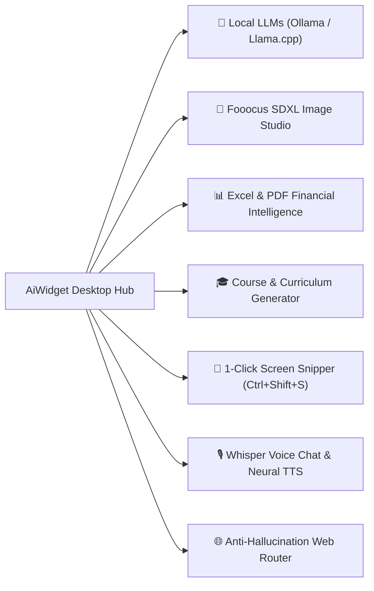
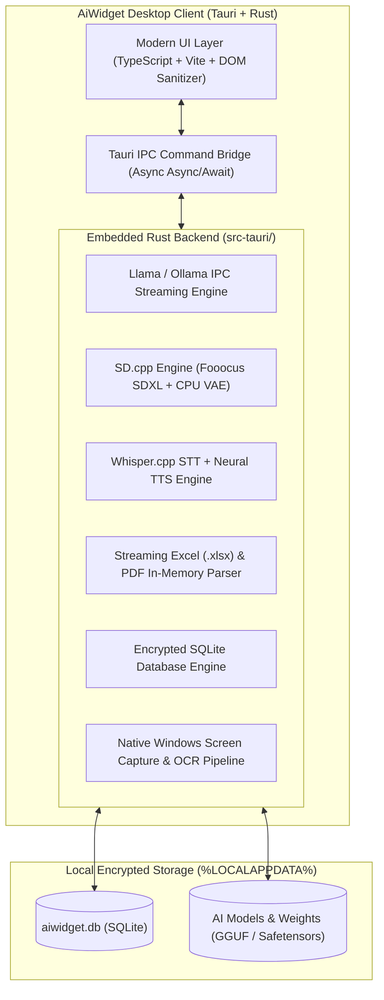

<div align="center">


# AiWidget

### 🚀 The Ultra-Lightweight (<8.6 MB), 100% Offline AI Copilot for Windows
**Empower your daily workflow with local LLMs, Fooocus SDXL photorealistic images, spreadsheet intelligence, and voice chat — with Zero Cloud Tracking.**

<br/>

[](https://www.gnu.org/licenses/agpl-3.0)
[](https://tauri.app)
[](https://www.rust-lang.org)
[](https://www.typescriptlang.org)
[]()
[]()
[-0078D6?logo=windows&style=flat-square)]()
[-6366f1?style=flat-square)]()

<br/>

[**🌐 Official Website**](https://shadevpro.github.io/AiWidget-Site/) • [**📦 Download v1.1.0**](https://github.com/ShaDevPro/AiWidget-Site/releases/tag/v1.1.0) • [**✨ Key Features**](#-core-capabilities) • [**📊 Benchmarks**](#-market-benchmarks) • [**🏢 Enterprise PRO**](#-enterprise-pro--commercial-licensing) • [**🤝 Contributing**](#-contributing)

</div>

---

## ⚡ The Problem with Modern Desktop AI

Today, developers, professionals, and privacy-conscious users face two frustrating compromises:

1. **Cloud-Based Assistants (*Microsoft Copilot, ChatGPT Desktop*)**: Every keystroke, proprietary source code snippet, financial Excel sheet, and screenshot is streamed to third-party cloud servers. They require monthly subscriptions and expose organizations to data privacy and regulatory compliance risks (GDPR, HIPAA, Legal privilege).
2. **Bloated Local AI Tools (*Electron wrappers*)**: Most open-source desktop clients require **400 MB to 1 GB of resident RAM** just to display a chat window, take up over 250 MB of disk space, and lack built-in image studios or native financial table extraction.

### 🌟 The AiWidget Solution
Built from the ground up with **Rust** and **Tauri**, **AiWidget** delivers a complete multimodal intelligence workstation that lives right on your desktop as a discreet floating widget:
* 🪶 **Featherweight footprint:** Only **8.1 MB** setup size and **< 80 MB of RAM**.
* 🛡️ **Zero-Knowledge Privacy:** 100% of LLM inference, OCR scanning, and document analysis runs locally on your own hardware.
* 🎨 **All-in-One Multimodal:** Chat, **Fooocus SDXL photorealistic generation**, spreadsheet financial extraction, course generation, screen snipping, and Whisper voice interaction in a single unified interface.

---

## 📊 Market Benchmarks

See how **AiWidget** stacks up against the most popular AI desktop applications on Windows:

| Capability | **AiWidget** | **LM Studio** | **Jan.ai** | **AnythingLLM** | **Microsoft Copilot** |
| :--- | :---: | :---: | :---: | :---: | :---: |
| **Form Factor** | 🟢 **Floating Widget / Bar / Popup** | 🔴 Heavy Window | 🔴 Heavy Window | 🟡 Partial Overlay | 🟢 Edge Sidebar |
| **Installer Size** | 🟢 **8.1 MB** | 🔴 ~350 MB | 🔴 ~160 MB | 🔴 ~380 MB | 🔴 Heavy Webview |
| **RAM Consumption** | 🟢 **< 80 MB** | 🟡 ~400 MB | 🔴 ~450 MB | 🔴 ~550 MB | 🔴 Cloud / Webview |
| **Privacy & Security** | 🟢 **100% Local (Air-Gapped)** | 🟢 100% Local | 🟢 100% Local | 🟢 100% Local | 🔴 **Cloud Tracking** |
| **Fooocus SDXL Studio (6.6 GB)**| 🟢 **Built-in + CPU VAE Tiling** | 🔴 No | 🔴 No | 🔴 No | 🟡 Cloud DALL-E (Paid) |
| **Spreadsheet Table Parser (.xlsx)**| 🟢 **Native Extraction & Sums**| 🔴 No | 🔴 No | 🟡 Text only | 🟡 Cloud limited |
| **Interactive Course Studio** | 🟢 **Curriculum, Quiz, Word Export**| 🔴 No | 🔴 No | 🔴 No | 🔴 No |
| **1-Click Screen Snipper** | 🟢 **`Ctrl+Shift+S` + OCR** | 🔴 No | 🔴 No | 🔴 No | 🟢 Cloud Vision |
| **Whisper Voice Chat + Neural TTS**| 🟢 **Continuous Local Loop** | 🔴 No | 🔴 No | 🔴 No | 🟢 Cloud |
| **Real-time Web Search Router** | 🟢 **Anti-Hallucination + Sources** | 🔴 No | 🔴 No | 🟡 API Key Required | 🟢 Bing Cloud |
| **Enterprise Server & Quotas** | 🟢 **On-Premise Ready** | 🔴 No | 🔴 No | 🟡 Basic | 🔴 30$/user/month |

---

## ✨ Core Capabilities



### 🧠 1. Local LLM Power & Streaming
* **Universal Compatibility:** Seamlessly connects with **Ollama** and embedded **Llama.cpp** engines.
* **Top Open-Weights Models:** Run *Qwen 2.5 (0.5B to 72B)*, *Gemma 2 (2B, 9B)*, *Mistral / Mixtral*, *Llama 3.2*, *DeepSeek-Coder*, *Phi-3.5*, and custom GGUFs.
* **Rich Markdown Engine:** Real-time token streaming with syntax highlighting for 50+ programming languages, copy-code shortcuts, table renderers, and $\KaTeX$ mathematical rendering.
* **Interactive Mermaid Diagrams:** Automatically detects and renders flowchart diagrams, sequence diagrams, class architectures, and Gantt charts directly in your chat.

### 🎨 2. Dual-Engine Image Studio (Fooocus SDXL + SD 1.5)
* **Fooocus SDXL (Juggernaut XL v8 - 6.6 GB):** Produce hyper-photorealistic 1024x1024 artwork with cinematic lighting, enhanced facial details, and automated prompt enhancement.
* **Rapid SD 1.5 (1.5 GB):** Lightweight generation optimized for laptops and low-VRAM GPUs.
* **Smart CPU VAE Tiling Fallback:** Zero Out-of-Memory (OOM) crashes. If your GPU runs low on VRAM, the VAE decoding gracefully offloads to system RAM.

### 📊 3. Spreadsheet & Document Financial Intelligence
* Drag and drop `.xlsx`, `.xls`, `.docx`, `.pdf`, `.csv`, `.txt`, `.json`, or scanned image receipts.
* In-memory streaming parser extracts tabular rows, tax breakdowns, invoice line sums, and contract obligations without uploading your private files anywhere.

### 🎓 4. Pedagogical Course & Training Studio
* Dedicated interactive education mode designed for teachers, students, and corporate trainers.
* Automatically creates comprehensive training modules, lesson plans, concrete business examples, and interactive multiple-choice quizzes.
* Export generated modules in 1 click to formatted **Microsoft Word (.docx)** or **Markdown**.

### 📸 5. Screen Snipper & Visual Debugging
* Press **`Ctrl + Shift + S`** or click the camera icon `[📸]` to snip any region of your screen, software error dialog, or spreadsheet.
* The image is automatically attached with high-accuracy OCR / Vision analysis, ready for immediate prompts like *"Fix this code error"* or *"Translate this invoice table"*.
* Supports standard Windows **`Win + Shift + S`** clipboard capture followed by direct **`Ctrl + V`** pasting into the chat.

### 🎙️ 6. Whisper Voice Chat & Neural TTS
* Hands-free voice conversation powered by local **Whisper.cpp** speech-to-text and high-fidelity neural text-to-speech.
* Continuous conversation loop for natural, fluid vocal interactions.

### 🌐 7. Anti-Hallucination Real-time Web Search Router
* Built-in intent router detects when a query requires up-to-date public information (weather, market trends, documentation, news).
* Scrapes facts in real-time, cross-verifies data, and provides clickable source citations to eliminate hallucinations.

### 🔐 8. Multi-Profile Isolation & SQLite Encryption
* Create isolated user spaces with personal master passwords.
* Conversation histories and user settings are stored in local SQLite databases protected with local encryption.

---

## 🚀 Download & Installation

### 📦 Windows Binaries (v1.1.0)
Get the official signed releases directly from our [Releases Page](https://github.com/ShaDevPro/AiWidget-Site/releases/tag/v1.1.0):

| Package | Type | Size | Description |
| :--- | :---: | :---: | :--- |
| [**AI-Widget-Setup.exe**](https://github.com/ShaDevPro/AiWidget-Site/releases/download/v1.1.0/AI-Widget-Setup.exe) | Installer | **8.13 MB** | Standard Windows NSIS Setup with auto-updates & Start Menu integration. |
| [**AI-Widget-Setup.msi**](https://github.com/ShaDevPro/AiWidget-Site/releases/download/v1.1.0/AI-Widget-Setup.msi) | MSI Package | **10.20 MB** | Enterprise Windows Installer for automated GPO / Active Directory deployment. |
| [**AI-Widget-Portable.exe**](https://github.com/ShaDevPro/AiWidget-Site/releases/download/v1.1.0/AI-Widget-Portable.exe) | Portable | **20.75 MB** | Zero-install standalone executable. Run directly from USB or air-gapped PC. |

---

### 💻 Build from Source

#### Prerequisites
* [Node.js](https://nodejs.org/) (v18.0 or later)
* [Rust & Cargo](https://rustup.rs/) (1.70 or later)
* [C++ Build Tools for Visual Studio](https://visualstudio.microsoft.com/visual-cpp-build-tools/)

```bash
# 1. Clone the repository
git clone https://github.com/ShaDevPro/AiWidget.git
cd AiWidget

# 2. Install frontend dependencies
npm install

# 3. Launch in live development mode (Hot-reload UI + Rust Backend)
npm run tauri:dev

# 4. Compile optimized standalone production release
npm run release:build
```

---

## 🏗️ System Architecture



---

## 🌍 Multilingual Support & RTL

AiWidget natively supports full internationalization with instantaneous language switching:
* 🇬🇧 **English:** Complete documentation, prompts, and interface.
* 🇫🇷 **Français:** Interface complète, prompts pédagogiques et analyse de documents adaptée.
* 🇸🇦 **العربية:** Full Right-To-Left (RTL) typography, Arabic fonts, and custom Arabic LLM system directives.

---

## 🏢 Enterprise PRO & Commercial Licensing

While the **AiWidget Desktop Client** is 100% free and open-source under the **GNU AGPLv3**, we offer an on-premise infrastructure for enterprises requiring centralized data sovereignty:

### 👑 AiWidget PRO Enterprise On-Premise Server:
* 🏢 **Centralized GPU Pooling:** Share high-end GPUs across 50 to 500 employee workstations without local GPU requirements.
* 👥 **Department Quota Governance:** Set fine-grained daily token limits for Engineering, Legal, and HR departments.
* 🔐 **Active Directory & GPO Policy Lock:** Enforce mandatory server endpoints and compliance rules across enterprise fleets.
* 🛡️ **Hardware-Locked HMAC Signature Licensing:** Completely air-gapped license management with zero external cloud dependencies.

📧 **Commercial & Enterprise Inquiries:** [sha.dev.pro@gmail.com](mailto:sha.dev.pro@gmail.com)  
🌐 **Website & Portal:** [https://shadevpro.github.io/AiWidget-Site/](https://shadevpro.github.io/AiWidget-Site/)

---

## 🤝 Contributing

We welcome contributions from developers worldwide! Whether you want to improve performance, add Linux/macOS support, translate the app into new languages, or introduce new document parsers:

1. **Fork** the repository: [https://github.com/ShaDevPro/AiWidget](https://github.com/ShaDevPro/AiWidget)
2. Create your feature branch (`git checkout -b feature/AmazingFeature`)
3. Commit your changes (`git commit -m "feat: Add AmazingFeature"`)
4. Push to the branch (`git push origin feature/AmazingFeature`)
5. Open a **Pull Request**

---

## 📜 License

This project is licensed under the **GNU Affero General Public License v3.0 (AGPLv3)**.  
See the [LICENSE](LICENSE) file for details.

---

<div align="center">

**Built with ❤️ for privacy, performance, and the global developer community by [ShaDevPro](https://github.com/ShaDevPro).**

⭐ **If you love AiWidget, don't forget to give this repository a star on GitHub!** ⭐

</div>
