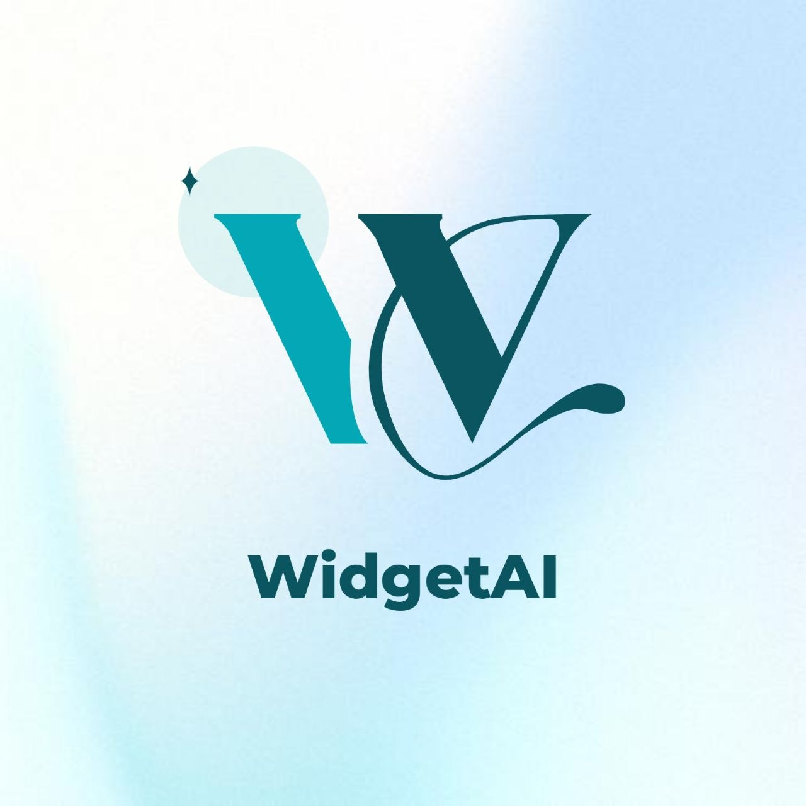
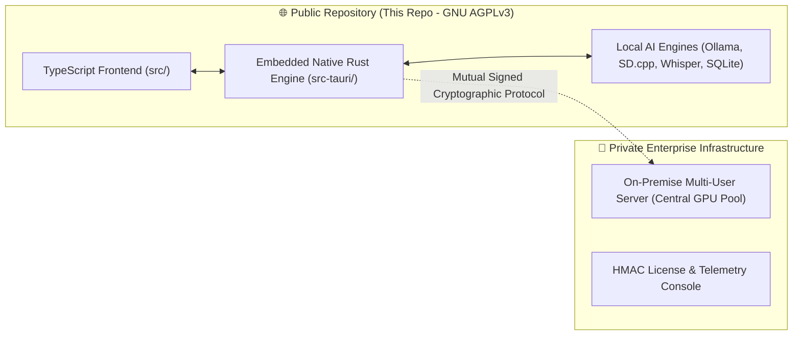
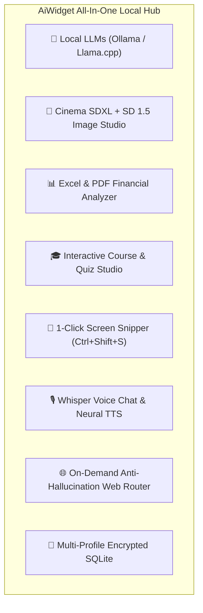

<div align="center">



# AiWidget

### 🚀 The Sovereign, Ultra-Lightweight (<8.6 MB) AI Workstation for Windows
**Run local LLMs, generate photorealistic Cinema SDXL art, analyze complex spreadsheets, build interactive courses, snip screens, and chat by voice — Local-First by default, Air-Gapped capable, with Zero silent network calls.**

<br/>

[](https://www.gnu.org/licenses/agpl-3.0)
[](https://tauri.app)
[](https://www.rust-lang.org)
[](https://www.typescriptlang.org)
[]()
[]()
[-0078D6?logo=windows&style=flat-square)]()
[-6366f1?style=flat-square)]()

<br/>

[**🌐 Official Website**](https://shadevpro.github.io/AiWidget-Site/) • [**📦 Download v1.1.0**](https://github.com/ShaDevPro/AiWidget-Site/releases/tag/v1.1.0) • [**✨ Feature Tour**](#-deep-feature-tour) • [**📊 Benchmarks**](#-market-benchmarks) • [**🛠️ Developer Guide**](#-developer--contributor-guide) • [**🏢 Enterprise PRO**](#-enterprise-pro--on-premise-server) • [**🤝 Contributing**](#-how-to-contribute)

</div>

---

## 📖 Repository Scope & Open-Core Model

> **Welcome to the official open-source repository of AiWidget!**

This repository contains the **complete client workspace**:
* 💻 **100% Frontend Source Code (`src/`)**: High-performance reactive TypeScript 5.4, Vite, Web Audio, $\KaTeX$ math engine, Mermaid.js diagramming, DOM sanitization, and floating widget shells.
* 🦀 **100% Embedded Native Rust Engine (`src-tauri/`)**: High-speed C++ `sd.cpp` diffusion wrapper, Whisper.cpp speech recognition, neural text-to-speech, in-memory streaming Excel/PDF RAG parsers, encrypted SQLite database, and mutual cryptographic transport.

Anyone in the worldwide developer community can clone this repository, run `npm run tauri:dev`, inspect the code, add new AI engines, translate into new languages, optimize performance, and compile standalone binaries.



---

## ⚡ The Manifesto: Why We Built AiWidget

Today, developers, professionals, and privacy-conscious users face two frustrating compromises:

1. **Cloud AI Privacy Risks (*Microsoft Copilot, ChatGPT Desktop*)**: Every prompt, proprietary source code snippet, financial spreadsheet (.xlsx), medical record, and screen snip is transmitted to third-party cloud servers. For regulated industries (lawyers, CPAs, doctors, defense, engineering), this violates **GDPR, HIPAA, and legal client privilege**.
2. **Bloated Electron Wrappers**: Traditional open-source desktop clients consume **500 MB to 1 GB of RAM** just to display a chat window, take up hundreds of megabytes on disk, and lack integrated image studios, document parsers, or course generators.

### 🌟 The AiWidget Breakthrough
Engineered natively in **Rust & Tauri**, **AiWidget** delivers a complete multimodal AI workstation in a discreet floating desktop widget:
* 🪶 **Featherweight Footprint:** **8.13 MB** installer size, **< 80 MB resident RAM** footprint.
* 🛡️ **Zero-Knowledge Air-Gapped Privacy:** All LLM inference, OCR parsing, and database queries run 100% on your machine.
* 🧩 **True Multimodal Independence:** Local LLMs, **Cinema SDXL photorealistic rendering**, spreadsheet financial extraction, course generation, screen snipping, and Whisper voice interaction — unified in one lightweight native app.

---

## 📊 Market Benchmarks

| Capability | **AiWidget** | **LM Studio** | **Jan.ai** | **AnythingLLM** | **Microsoft Copilot** |
| :--- | :---: | :---: | :---: | :---: | :---: |
| **Form Factor** | 🟢 **Floating Widget / Bar / Popup** | 🔴 Full Window | 🔴 Full Window | 🟡 Partial Overlay | 🟢 Edge Sidebar |
| **Installer Size** | 🟢 **8.13 MB** | 🔴 ~350 MB | 🔴 ~160 MB | 🔴 ~380 MB | 🔴 Heavy Webview |
| **RAM Consumption** | 🟢 **< 80 MB** | 🟡 ~400 MB | 🔴 ~450 MB | 🔴 ~550 MB | 🔴 Cloud / Webview |
| **Data Sovereignty** | 🟢 **100% Local (Air-Gapped)** | 🟢 100% Local | 🟢 100% Local | 🟢 100% Local | 🔴 **Cloud Tracking** |
| **Cinema SDXL Studio (6.6 GB)**| 🟢 **Built-in + CPU VAE Tiling** | 🔴 No | 🔴 No | 🔴 No | 🟡 Cloud DALL-E (Paid) |
| **Fast SD 1.5 Studio (1.5 GB)** | 🟢 **Built-in (15s renders)** | 🔴 No | 🔴 No | 🔴 No | 🔴 No |
| **Spreadsheet Intelligence (.xlsx)**| 🟢 **Native Extraction & Sums**| 🔴 No | 🔴 No | 🟡 Text only | 🟡 Cloud limited |
| **Course & Training Studio** | 🟢 **Curriculum, Quiz, Word (.docx)**| 🔴 No | 🔴 No | 🔴 No | 🔴 No |
| **1-Click Screen Snipper** | 🟢 **`Ctrl+Shift+S` + OCR** | 🔴 No | 🔴 No | 🔴 No | 🟢 Cloud Vision |
| **Whisper Voice + Neural TTS**| 🟢 **Continuous Loop** | 🔴 No | 🔴 No | 🔴 No | 🟢 Cloud |
| **Anti-Hallucination Web Router** | 🟢 **Auto-Trigger on Demand** | 🔴 No | 🔴 No | 🟡 Paid API Key | 🟢 Bing Cloud |
| **Interactive Mermaid & LaTeX** | 🟢 **Zoom, Fullscreen & Export** | 🟡 Basic code | 🔴 Raw text | 🟡 Basic | 🟡 Basic |
| **Enterprise Server & Quotas** | 🟢 **On-Premise Ready** | 🔴 No | 🔴 No | 🟡 Basic | 🔴 30$/user/month |

---

## ✨ Deep Feature Tour



---

### 🎨 1. Dual-Engine Local Image Studio (Cinema SDXL & Fast SD 1.5)

Forget setting up complex 30 GB Python environments or paying monthly cloud subscriptions. AiWidget embeds a high-performance **C++ (`sd.cpp`) diffusion pipeline** directly in Rust:

* 🎬 **Cinema SDXL — Juggernaut XL v8 (6.6 GB)**:
  * Generates hyper-photorealistic **1024x1024** cinema-quality artwork, character portraits, product concepts, and architectural visualizations.
  * **Automated Prompt Translation & Expansion**: Type prompts in French or Arabic; AiWidget automatically translates and optimizes them into specialized Stable Diffusion positive and negative conditioning tokens (inspired by Fooocus-style cinematic presets).
  * **Built-in Cinematic Styles**: Photorealistic 8K, Masterpiece, Cinematic Lighting, Hyper-Detailed Skin Texture, and Anime/Digital Art presets.
* ⚡ **Rapid SD 1.5 (1.5 GB)**:
  * Ultra-fast generation (15–20 seconds) engineered for standard consumer laptops, older GPUs, and quick ideation.
* 🛡️ **Smart CPU VAE Tiling Fallback (Zero OOM Crashes)**:
  * Traditional SDXL software crashes with `CUDA Out-Of-Memory` on 4 GB or 6 GB VRAM GPUs during the heavy VAE decode step.
  * AiWidget automatically detects low VRAM thresholds and offloads VAE tiling computation to system RAM, guaranteeing successful renders without crashes.
* 🖼️ **Interactive Image Gallery**: Fullscreen modal view, instant PNG save, copy to clipboard, and generation metadata inspection (seed, steps, CFG, sampler).

---

### 🎓 2. Interactive Course & Education Studio

A dedicated pedagogical engine designed for teachers, corporate instructors, university students, and self-learners:

* 📚 **Complete Curriculum Structuring**: Generates structured courses tailored to any difficulty level (*Beginner*, *Intermediate*, *Advanced*), including learning objectives, prerequisite summaries, and module breakdowns.
* 💡 **Step-by-Step Lessons with Real-World Analogies**: Breaks down abstract technical, legal, scientific, or business topics into digestible lessons illustrated with practical case studies.
* 📝 **Interactive Quizzes & MCQs**: Automatically embeds multiple-choice questions with detailed answer keys, feedback explanations, and scoring mechanisms.
* 📄 **Universal 1-Click Export**:
  * Export directly to formatted **Microsoft Word (.docx)** with custom heading hierarchies, callout boxes, and styled tables.
  * Export to clean **Markdown (.md)** for seamless integration into Obsidian, Notion, or GitHub.

---

### 🌐 3. On-Demand Anti-Hallucination Web Router (Strictly User-Controlled)
 
Eliminate hallucinations when fresh factual knowledge is required, while strictly preserving your privacy:

* 🔒 **Local-First by Default — Zero Silent Network Requests**:
  * All core intelligence, LLM inference, image generation, voice chat, and document RAG run **100% locally on your device**.
  * Internet access is **never activated silently**.
* 🤖 **Smart Intent Detection & Explicit Permission Gate**:
  * When you ask a question requiring live or time-sensitive data (e.g., *"What will the weather be tomorrow in New York?"*, *"Latest stock market indices"*, or *"Recent software releases"*), AiWidget automatically detects the intent.
  * Instead of quietly calling the network, AiWidget displays an explicit confirmation gate:  
    `🌐 This question requires live web information. Allow AiWidget to search the web? [Allow] [Deny]`
  * You can also explicitly toggle the **`🌐 Web`** mode button in the chat input bar whenever you want web grounding enabled.
* 🔍 **Real-Time Web Scraping & Fact Extraction**:
  * When authorized, queries public search engines in the background without transmitting user identities.
  * Strips HTML bloat, extracts core factual paragraphs, and injects verified context into the LLM prompt.
* 🔗 **Clickable Verified Source Citations**:
  * Every fact is accompanied by direct, clickable URL source badges so you can verify the truth with zero hallucination.
* 🛡️ **Air-Gapped Capable**:
  * In strictly air-gapped or high-security corporate environments, Web Search can remain permanently disabled with zero impact on local LLM, SDXL, or document analysis features.

---

### 📊 4. Financial Spreadsheet & Document Intelligence (.xlsx / .pdf / .docx)

* 📈 **In-Memory Streaming XLSX & CSV Parser**:
  * Drag-and-drop spreadsheets, budget exports, or client estimates.
  * Automatically reconstructs tabular columns, identifies currency rows, calculates sub-totals, tax amounts, and flags discrepancies.
* 📑 **Universal PDF & DOCX Extraction**:
  * Summarize multi-page legal contracts, research whitepapers, and invoices with zero cloud exposure.
* 🔍 **OCR Image Extraction**:
  * Scanned invoices, receipts, and photos of paper documents are processed through our local OCR engine to extract editable text and numbers.

---

### 📸 5. Screen Snipper & Visual Debugging in 1 Clic

* ⚡ **Global Shortcut (`Ctrl + Shift + S`) & Toolbar Camera Button `[📸]`**:
  * Instantly snip any open window, software error code, compiler log, or web dashboard.
* 📋 **Native Clipboard Integration**:
  * Use standard Windows **`Win + Shift + S`** to grab an area, then press **`Ctrl + V`** directly in AiWidget: the image thumbnail attaches automatically.
* 👁️ **Visual OCR & Multimodal Analysis**:
  * Prompts like *"Explain this stack trace"*, *"Translate this screenshot"*, or *"Extract this table into Markdown"* work immediately with local models.

---

### 🎙️ 6. Whisper Voice Chat & Neural Speech Synthesis

* 🎤 **Whisper.cpp Integration**: High-accuracy local speech-to-text supporting multiple accents and languages.
* 🗣️ **Neural Text-to-Speech**: Crystal-clear male and female natural voices for English, French, and Arabic.
* 🔄 **Continuous Hands-Free Conversation Mode**: Speak naturally to your assistant, listen to its vocalized answer, and have it automatically resume listening for your follow-up questions.

---

### 📐 7. Interactive LaTeX Math & Mermaid Diagrams

* 📐 **$\KaTeX$ Mathematical Engine**: Render complex mathematical formulas, physics equations, matrices, and statistical distributions with crisp vector rendering.
* 📊 **Mermaid.js Flowchart Engine**: Visualizes flowcharts, architecture diagrams, sequence maps, class structures, and Gantt timelines with one-click full-screen expansion and PNG export.

---

### 🔐 8. Multi-Profile Isolation & SQLite Encryption

* 👥 **Isolated Workspaces**: Create independent user profiles (e.g., *Personal*, *Work*, *Client X*) with dedicated conversation histories, custom system prompts, and individual master passwords.
* 🔒 **Encrypted Local Storage**: SQLite databases are stored under `%LOCALAPPDATA%\aiwidget` protected with local cryptographic encryption.

---

## 🚀 Download & Installation

### 📦 Windows Binaries (v1.1.0)
Download the official signed releases from our [Releases Page](https://github.com/ShaDevPro/AiWidget-Site/releases/tag/v1.1.0):

| Package | Format | Size | Target Environment |
| :--- | :---: | :---: | :--- |
| [**AI-Widget-Setup.exe**](https://github.com/ShaDevPro/AiWidget-Site/releases/download/v1.1.0/AI-Widget-Setup.exe) | Installer | **8.13 MB** | Standard Windows NSIS installer with Start Menu shortcuts & auto-update daemon. |
| [**AI-Widget-Setup.msi**](https://github.com/ShaDevPro/AiWidget-Site/releases/download/v1.1.0/AI-Widget-Setup.msi) | MSI | **10.20 MB** | Enterprise Windows Installer for automated Active Directory / GPO fleet deployment. |
| [**AI-Widget-Portable.exe**](https://github.com/ShaDevPro/AiWidget-Site/releases/download/v1.1.0/AI-Widget-Portable.exe) | Portable | **20.75 MB** | Zero-installation standalone executable. Ideal for USB drives and air-gapped computers. |

---

## 🛠️ Developer & Contributor Guide

### 💻 Prerequisites
To build and develop AiWidget locally, ensure you have:
* [Node.js](https://nodejs.org/) (v18.0 or later) & `npm`
* [Rust & Cargo](https://rustup.rs/) (1.70 or later)
* [C++ Build Tools for Visual Studio](https://visualstudio.microsoft.com/visual-cpp-build-tools/) (MSVC x64)

---

### 🚀 Quick Start (Live Hot-Reload Development)

```bash
# 1. Clone the repository
git clone https://github.com/ShaDevPro/AiWidget.git
cd AiWidget

# 2. Install frontend dependencies
npm install

# 3. Launch live hot-reload development mode
npm run tauri:dev
```

---

### 📦 Production Build Pipeline

```bash
# Compile frontend + Tauri binaries (Setup.exe, Setup.msi, Portable.exe)
npm run release:build
```

The resulting optimized binaries will be placed in the [`release/`](release/) directory.

---

### 📁 Project Architecture & Directory Map

```text
AiWidget/
├── src/                          # 💻 Full Frontend (TypeScript + Vite)
│   ├── modules/
│   │   ├── chat/                 # Streaming LLM chat controller & message renderer
│   │   ├── image/                # Cinema SDXL & Fast SD 1.5 Image Studio
│   │   ├── course/               # Interactive Course & Quiz Studio Engine
│   │   ├── snipper/              # ScreenSnipper (Ctrl+Shift+S screenshot tool)
│   │   ├── document/             # In-Memory Streaming Excel (.xlsx) & PDF parser
│   │   ├── voice/                # Whisper & Neural TTS Controller
│   │   ├── markdown/             # KaTeX math & Mermaid diagram renderers
│   │   ├── license/              # Enterprise server connection adapter
│   │   ├── telemetry/            # Privacy-compliant anonymous metrics pinger
│   │   └── shell/                # Widget UI Shell (Bubble, Compact, Expanded)
│   ├── styles/                   # Modular Fluent Design CSS sheets
│   └── i18n/                     # Multilingual dictionaries (FR, EN, AR RTL)
│
├── src-tauri/                    # 🦀 Embedded Native Rust Backend Engine
│   ├── src/
│   │   ├── sd_engine.rs          # SD.cpp C++ diffusion wrapper (SDXL + CPU VAE)
│   │   ├── tts_engine.rs         # Neural TTS speech synthesizer
│   │   ├── whisper_engine.rs     # Whisper.cpp speech-to-text pipeline
│   │   ├── llama_engine.rs       # Embedded Llama.cpp & Ollama IPC bridge
│   │   ├── web_search.rs         # Anti-hallucination web query router
│   │   ├── db.rs                 # Local encrypted SQLite database engine
│   │   ├── security_engine.rs    # Local hardware attestation & anti-tamper security engine
│   │   └── commands/             # Tauri IPC Command Bridge (Async Handlers)
│   ├── Cargo.toml                # Rust dependencies & metadata
│   └── tauri.conf.json           # Tauri window & bundle configuration
│
└── website/                      # 🌐 Public Showcase Website (GitHub Pages)
```

---

### ⚡ Available NPM Scripts

| Command | Description |
| :--- | :--- |
| `npm run tauri:dev` | Starts Vite dev server and launches the native Tauri desktop window with live hot-reload. |
| `npm run build` | Compiles and type-checks the TypeScript frontend (`tsc && vite build`). |
| `npm run tauri:build` | Compiles the optimized native Windows Rust desktop executable. |
| `npm run release:build` | Complete build: bundles frontend + builds Windows NSIS Installer, Enterprise MSI & Portable packages. |

---

## 🌍 Multilingual Support & RTL

AiWidget natively supports comprehensive bidirectional internationalization:
* 🇬🇧 **English:** Complete UI, prompt templates, and documentation.
* 🇫🇷 **Français:** Interface complète, prompts pédagogiques et analyse de documents adaptée.
* 🇸🇦 **العربية:** Full Right-To-Left (RTL) typography, Arabic fonts, and custom Arabic LLM system directives.

*Want to add a new language? Simply add a new locale file in [`src/i18n/locales/`](src/i18n/locales/) and submit a Pull Request!*

---

## 🏢 Enterprise PRO & On-Premise Server

While the **AiWidget Desktop Client** is 100% free and open-source under the **GNU AGPLv3**, we offer an on-premise infrastructure for enterprises requiring centralized data sovereignty:

### 👑 AiWidget PRO Enterprise Features:
* 🏢 **Centralized GPU Pooling:** Connect 50 to 500 employee desktops to a central On-Premise GPU server without requiring discrete GPUs on client PCs.
* 👥 **Department Quota Governance:** Set fine-grained daily token limits for Engineering, Legal, and HR departments.
* 🔐 **Active Directory & GPO Policy Lock:** Enforce mandatory server endpoints and compliance rules across enterprise fleets.
* 🛡️ **Hardware-Locked HMAC Signature Licensing:** Completely air-gapped license management with zero external cloud dependencies.

📧 **Commercial & Enterprise Inquiries:** [s.h.a.dev.pro@gmail.com](mailto:s.h.a.dev.pro@gmail.com)  
🌐 **Website & Portal:** [https://shadevpro.github.io/AiWidget-Site/](https://shadevpro.github.io/AiWidget-Site/)

---

## 🤝 How to Contribute

We warmly welcome contributions from developers worldwide! Whether you want to optimize performance, add Linux/macOS support, translate the app into new languages, or introduce new document parsers:

1. **Fork** the repository: [https://github.com/ShaDevPro/AiWidget](https://github.com/ShaDevPro/AiWidget)
2. Create your feature branch (`git checkout -b feature/AmazingFeature`)
3. Commit your changes (`git commit -m "feat: Add AmazingFeature"`)
4. Push to the branch (`git push origin feature/AmazingFeature`)
5. Open a **Pull Request**

---

## 📜 License

This project is licensed under the **GNU Affero General Public License v3.0 (AGPLv3)**.  
See the [LICENSE](LICENSE) file for details.

---

<div align="center">

**Built with ❤️ for privacy, performance, and the global developer community by [ShaDevPro](https://github.com/ShaDevPro).**

⭐ **If you find AiWidget valuable, please consider starring this repository on GitHub!** ⭐

</div>
