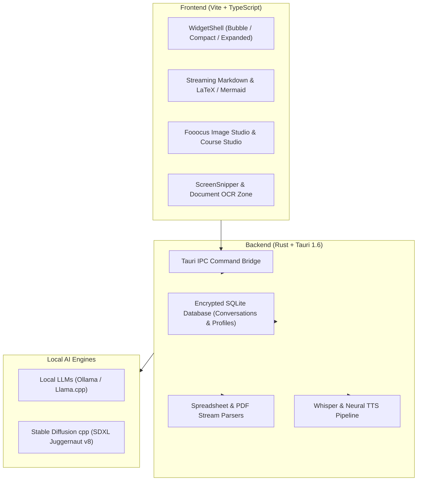

# AI Widget — 100% Local & Privacy-First AI Copilot for Windows

<div align="center">


### The ultra-lightweight (<8.6 MB), 100% offline AI desktop assistant built with Rust & Tauri.

[](https://www.gnu.org/licenses/agpl-3.0)
[](https://tauri.app)
[](https://www.rust-lang.org)
[](https://www.typescriptlang.org)
[]()
[]()
[]()
[-6366f1?style=flat-square)]()

[**Official Website**](https://shadevpro.github.io/AiWidget-Site/) · [**Download Releases**](https://github.com/ShaDevPro/AiWidget-Site/releases/tag/v1.1.0) · [**Report Bug**](https://github.com/ShaDevPro/AiWidget/issues) · [**Enterprise PRO**](mailto:sha.dev.pro@gmail.com)

</div>

---

## 💡 Why AI Widget?

Typical desktop AI wrappers are bloated **Electron apps (>150 MB downloads, 500 MB+ RAM)** or cloud assistants (like *Microsoft Copilot*) that send all your keystrokes, confidential files, and screen context to remote servers.

**AI Widget** is engineered from scratch in **Rust + Tauri**:
* 🚀 **Weighs only 8.6 MB** (Installer) and consumes **< 80 MB of RAM**.
* 🛡️ **Zero-Knowledge Privacy:** 100% of prompts, Excel sheets, and documents stay strictly on your local PC.
* ⚡ **All-In-One Multimodal:** Integrates local LLM chat, **Fooocus SDXL photorealistic image generation**, financial spreadsheet analysis, interactive course generation, screen snipping, and Whisper voice chat into a discreet desktop overlay.

---

## 📊 Market Comparison

| Feature | **AI Widget** | **LM Studio** | **Jan.ai** | **AnythingLLM** | **Microsoft Copilot** |
| :--- | :---: | :---: | :---: | :---: | :---: |
| **Form Factor** | 🟢 **Floating Widget / Bar** | 🔴 Window only | 🔴 Window only | 🟡 Partial overlay | 🟢 Sidebar |
| **Binary Size & RAM** | 🟢 **8.6 MB / < 80 MB RAM** | 🟡 400 MB RAM | 🔴 450 MB RAM | 🔴 500 MB+ RAM | 🔴 Heavy Webview |
| **Privacy & Offline** | 🟢 **100% Local** | 🟢 100% Local | 🟢 100% Local | 🟢 100% Local | 🔴 **Cloud-tracked** |
| **Fooocus SDXL Studio** | 🟢 **Built-in (Juggernaut XL)**| 🔴 No | 🔴 No | 🔴 No | 🟡 DALL-E (Paid Cloud) |
| **Excel (.xlsx) Table Parser**| 🟢 **Native Extraction** | 🔴 No | 🔴 No | 🟡 Text only | 🟡 Cloud limited |
| **Interactive Course Studio**| 🟢 **Curriculum & Quiz** | 🔴 No | 🔴 No | 🔴 No | 🔴 No |
| **1-Click Screen Snipper** | 🟢 **`Ctrl+Shift+S` + OCR** | 🔴 No | 🔴 No | 🔴 No | 🟢 Cloud Vision |
| **Whisper Voice + Neural TTS**| 🟢 **Real-time Local** | 🔴 No | 🔴 No | 🔴 No | 🟢 Cloud |

---

## ✨ Key Features

### 🧠 1. Local LLM Power (Ollama & Llama.cpp)
* Run state-of-the-art open-weights models: **Qwen 2.5**, **Gemma 2**, **Mistral**, **Llama 3.2**, **DeepSeek Coder**, and **Phi-3**.
* Real-time token streaming with syntax-highlighted code blocks, copy buttons, and LaTeX math formulas ($\KaTeX$).
* Render interactive **Mermaid.js** flowcharts, architecture diagrams, and sequence maps directly in chat.

### 🎨 2. Dual-Engine Image Studio (Fooocus SDXL + SD 1.5)
* **Fooocus SDXL (Juggernaut XL v8 - 6.6 GB):** Ultra-photorealistic 1024x1024 generations with cinematic lighting, portrait enhancement, and automatic prompt translation.
* **Rapid SD 1.5 (1.5 GB):** Fast generation for lower VRAM and entry-level laptops.
* **Smart CPU VAE Tiling Fallback:** Zero Out-of-Memory (OOM) crashes even on 4 GB GPUs or shared VRAM.

### 📊 3. Spreadsheet & Document Financial Intelligence
* Drag-and-drop `.xlsx`, `.xls`, `.docx`, `.pdf`, or scanned images.
* Automatically extracts structured tables, calculates tax/totals, sums invoice lines, and summarizes multi-page contracts.

### 🎓 4. Interactive Course & Education Studio
* Dedicated pedagogical engine to generate structured curriculums, step-by-step lessons, real-world examples, and interactive quizzes.
* Export generated courses in 1 click to formatted **Microsoft Word (.docx)** or **Markdown**.

### 📸 5. Screen Snipper & Visual Intelligence
* Hit **`Ctrl + Shift + S`** or click the camera button `[📸]` to capture any screen zone, application error, or browser window.
* Automatically parses text via OCR / Vision models and attaches the screenshot for instant debugging.
* Seamlessly supports **`Win + Shift + S`** followed by **`Ctrl + V`** pasting.

### 🎙️ 6. Whisper Voice Chat & Neural TTS
* Hands-free continuous voice interaction powered by local **Whisper** speech recognition and high-fidelity neural text-to-speech.

### 🌐 7. Anti-Hallucination Real-time Web Search
* Intelligent local query router that fetches public facts, weather forecasts, and documentation with live source citations.

### 🔐 8. Isolated Multi-Profiles & SQLite Encryption
* Workspaces with personal passwords, isolated histories, and encrypted local databases.

---

## 🚀 Quick Start & Installation

### Option 1: Direct Installer (Recommended)
Download the latest official build from the [Releases Page](https://github.com/ShaDevPro/AiWidget-Site/releases/tag/v1.1.0):
* 📦 **Standard Setup:** [`AI-Widget-Setup.exe`](https://github.com/ShaDevPro/AiWidget-Site/releases/download/v1.1.0/AI-Widget-Setup.exe) (8.6 MB)
* 🏢 **Enterprise MSI:** [`AI-Widget-Setup.msi`](https://github.com/ShaDevPro/AiWidget-Site/releases/download/v1.1.0/AI-Widget-Setup.msi) (10.5 MB)
* ⚡ **Portable Version:** [`AI-Widget-Portable.exe`](https://github.com/ShaDevPro/AiWidget-Site/releases/download/v1.1.0/AI-Widget-Portable.exe) (No installation required)

### Option 2: Build from Source

#### Prerequisites:
* **Node.js** (v18+)
* **Rust** & **Cargo** (1.70+)
* **C++ Build Tools for Visual Studio**

```bash
# 1. Clone the repository
git clone https://github.com/ShaDevPro/AiWidget.git
cd AiWidget

# 2. Install frontend dependencies
npm install

# 3. Launch in development mode
npm run tauri:dev

# 4. Build optimized production release
npm run release:build
```

---

## 🏗️ Architecture & Technology Stack



---

## 🌍 Multilingual Support (i18n)

AI Widget natively supports complete bidirectional internationalization:
* 🇫🇷 **Français** (Interface & prompts adaptés)
* 🇬🇧 **English** (Full UI & documentation)
* 🇸🇦 **العربية** (Complete RTL layout, fonts, and Arabic LLM system directives)

---

## 📜 License & Commercial Inquiries

### Open-Source Community License:
This project is licensed under the **GNU Affero General Public License v3.0 (AGPLv3)**. See the [LICENSE](LICENSE) file for details.

### 🏢 Commercial & Enterprise Licensing (Dual-Licensing):
If you wish to use AI Widget in a proprietary commercial environment without AGPLv3 copyleft obligations, or if your organization requires the **AI Widget Enterprise On-Premise Central Server** (with department quotas, active directory binding, and centralized GPU pools), please contact:

📧 **Commercial Inquiries:** [sha.dev.pro@gmail.com](mailto:sha.dev.pro@gmail.com)  
🌐 **Website:** [https://shadevpro.github.io/AiWidget-Site/](https://shadevpro.github.io/AiWidget-Site/)
